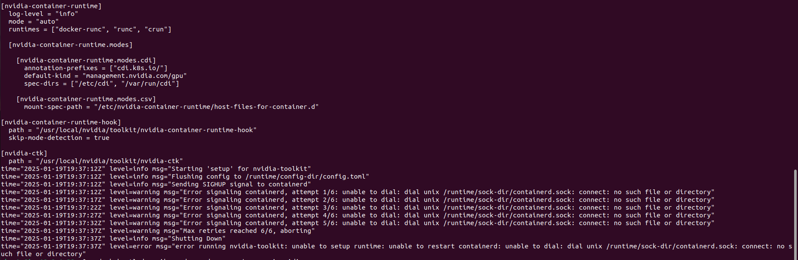

# Gpu operator setup in Kubernetes 

The NVIDIA GPU Operator simplifies the process of setting up GPUs in Kubernetes clusters. In this doc we will walk through how to set up GPU-based container in kubernetes by configuring the NVIDIA GPU Operator.To deploy and manage NVIDIA GPUs efficiently, using a GPU operator is crucial.

## Prerequisites

Before diving into the installation and setup, ensure you have the following:

* A Kubernetes cluster with at least one GPU-enabled node.
* Kubernetes CLI (kubectl) installed and configured.
* Helm installed for deploying the NVIDIA GPU Operator.

For this we launched t3.medium instances for master node and g4dn instances for worker node . 

### Understanding the NVIDIA GPU Operator

The GPU Operator is a Kubernetes add-on that simplifies the deployment and management of GPU resources in a cluster.The NVIDIA GPU Operator manages the lifecycle of NVIDIA GPU resources in a Kubernetes cluster. It automates tasks like:

* Driver installation
* GPU monitoring
* GPU resource management for workloads
* Integration with CUDA, NVIDIA Container Toolkit, and other libraries

### Nvidia Gpu operator Architecture in Kubernetes cluster 

This diagram shows how the NVIDIA GPU Operator interacts with the Kubernetes cluster and GPU-enabled nodes


**GPU Worker Node Components**

1. Kubelet manages local container runtime
2. NVIDIA Driver enables GPU access
3. NVIDIA Container Toolkit provides container GPU support
4. Device Plugin advertises GPU resources back to the cluster (resources reporter)

### Install k3s on master node 
```bash 
curl -sfL https://get.k3s.io | sh -

```
**Retrieve the token from the master node to join worker nodes:**

```bash 
sudo cat /var/lib/rancher/k3s/server/node-token
```
Copy the token.

SSH into each worker node and run the following command to join it to the cluster (replace <master-ip> with the private IP of the master node and <token> with the token obtained earlier):

```bash 
curl -sfL https://get.k3s.io | K3S_URL=https://<master-ip>:6443 K3S_TOKEN=<token> sh -

```
### Setting Up NVIDIA GPU in Kubernetes: 

**Step 1. Add GPU-enabled Nodes** 
You must have NVIDIA GPU nodes in a Kubernetes cluster. If you are working on the Public cloud like AWS or GCP choose a GPU instance `g4dn g5 etc` 

**Step 2. Check GPU Availability** 
After provisioning the GPU nodes, confirm that they are visible in the cluster.

```bash 
kubectl describe nodes  |  tr -d '\000' | sed -n -e '/^Name/,/Roles/p' -e '/^Capacity/,/Allocatable/p' -e '/^Allocated resources/,/Events/p'  | grep -e Name  -e  nvidia.com  | perl -pe 's/\n//'  |  perl -pe 's/Name:/\n/g' | sed 's/nvidia.com\/gpu:\?//g'  | sed '1s/^/Node Available(GPUs)  Used(GPUs)/' | sed 's/$/ 0 0 0/'  | awk '{print $1, $2, $3}'  | column -t
```


### Nvidia container setup on worker node 
```bash 
curl -fsSL https://nvidia.github.io/libnvidia-container/gpgkey | sudo gpg --dearmor -o /usr/share/keyrings/nvidia-container-toolkit-keyring.gpg \
  && curl -s -L https://nvidia.github.io/libnvidia-container/stable/deb/nvidia-container-toolkit.list

sudo apt install -y nvidia-container-runtime

```
`Verify GPU Nodes` on worker 

```bash 
nvidia-smi 
```
### Helm install on master node 

```bash 
curl -fsSL -o get_helm.sh https://raw.githubusercontent.com/helm/helm/master/scripts/get-helm-3 \
    && chmod 700 get_helm.sh \
    && ./get_helm.sh
```

### Installing NVIDIA GPU Operator 

The NVIDIA GPU Operator is designed to manage NVIDIA drivers, container runtime, and monitoring tools. To install it:

**Step 1. Add the NVIDIA Helm Repository:**
```bash 
helm repo add nvidia https://helm.ngc.nvidia.com/nvidia \
    && helm repo update

```
`Before install nvidia gpu operator configure this in master node ` 

*Add kube directory *

```bash 

# Create the .kube directory
mkdir -p ~/.kube

# Copy the k3s config file
sudo cp /etc/rancher/k3s/k3s.yaml ~/.kube/config

# Change ownership of the config file
sudo chown $(id -u):$(id -g) ~/.kube/config

# Set KUBECONFIG environment variable
export KUBECONFIG=~/.kube/config

# Verify kubectl works
sudo kubectl get nodes
```


**Step 2. Install the GPU Operator via Helm** 

`Specifying Configuration Options for containerd`
When you use containerd as the container runtime, the following configuration options are used with the container-toolkit deployed with GPU Operator:
`gpu-values.yaml`

```yml
driver: 
  version: "550.54.15"
toolkit:
   env:
   - name: CONTAINERD_CONFIG
     value: /etc/containerd/config.toml
   - name: CONTAINERD_SOCKET
     value: /run/containerd/containerd.sock
   - name: CONTAINERD_RUNTIME_CLASS
     value: nvidia
   - name: CONTAINERD_SET_AS_DEFAULT
     value: true
```
These options are defined as follows:

**CONTAINERD_CONFIG**
The path on the host to the `containerd` config you would like to have updated with support for the `nvidia-container-runtime`. By default this will point to `/etc/containerd/config.toml` (the default location for containerd). It should be customized if your containerd installation is not in the default location.

**CONTAINERD_SOCKET**
The path on the host to the socket file used to communicate with `containerd`. The operator will use this to send a SIGHUP signal to the containerd daemon to reload its config. By default this will point to `/run/containerd/containerd.sock` (the default location for containerd). It should be customized if your containerd installation is not in the default location.

```bash 
helm install test gpu-operator --namespace gpu-operator --create-namespace --wait -f gpu-values.yaml
```

**Step 3. Verify the installation** 
```bash
sudo kubectl get pod -n gpu-operator
```
 

`Here i got CrashLoopback status in this pod nvidia-container-toolkit-daemonset-pc5j8` 



because intially i use below script to install gpu-operator 

```bash 
helm install --wait --generate-name \
     -n gpu-operator \
     nvidia/gpu-operator
```

**Sterp 4. Check Node GPU Resources** 

```bash 
kubectl describe node <node-name> | grep -i nvidia
```


### GPU Resource Allocation Flow in Kubernetes


