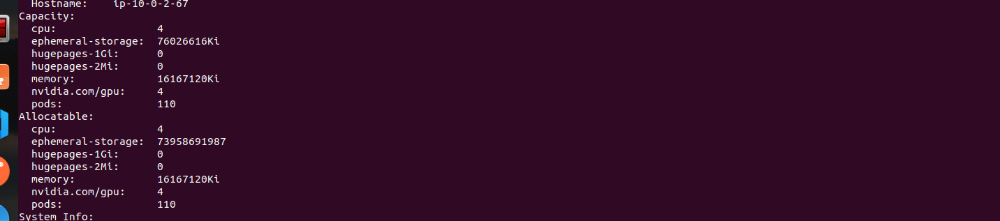
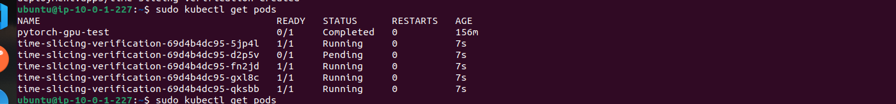

# Time-Slicing GPUs in Kubernetes

The NVIDIA GPU Operator enables oversubscription of GPUs through a set of extended options for the NVIDIA Kubernetes Device Plugin. GPU time-slicing enables workloads that are scheduled on oversubscribed GPUs to interleave with one another.

`This mechanism for enabling time-slicing of GPUs in Kubernetes enables a system administrator to define a set of replicas for a GPU, each of which can be handed out independently to a pod to run workloads on`. Unlike Multi-Instance GPU (MIG), there is no memory or fault-isolation between replicas, but for some workloads this is better than not being able to share at all. Internally, GPU time-slicing is used to multiplex workloads from replicas of the same underlying GPU.

**Comparison: Time-Slicing and Multi-Instance GPU** 

The latest generations of NVIDIA GPUs provide an operation mode called Multi-Instance GPU (MIG). MIG allows you to partition a GPU into several smaller, predefined instances, each of which looks like a mini-GPU that provides memory and fault isolation at the hardware layer. You can share access to a GPU by running workloads on one of these predefined instances instead of the full native GPU.

MIG support was added to Kubernetes in 2020.

Time-slicing trades the memory and fault-isolation that is provided by MIG for the ability to share a GPU by a larger number of users. Time-slicing also provides a way to provide shared access to a GPU for older generation GPUs that do not support MIG. However, you can combine MIG and time-slicing to provide shared access to MIG instances.


## Configuration 

On a machine with one GPU, the following config map configures Kubernetes so that the node advertises four GPU resources. A machine with two GPUs advertises eight GPUs, and so on.

`Sample config map`

1. Create a file, such as `time-slicing-config-all.yaml`, with contents like the following example:

`Perform the following steps to configure GPU time-slicing if you already installed the GPU operator and want to apply the same time-slicing configuration on all nodes in the cluster`
```yml
apiVersion: v1
kind: ConfigMap
metadata:
  name: time-slicing-config-all
data:
  any: |-
    version: v1
    flags:
      migStrategy: none
    sharing:
      timeSlicing:
        resources:
        - name: nvidia.com/gpu
          replicas: 4

```
2. Add the config map to the same namespace as the GPU operator:
```bash
kubectl create -n gpu-operator -f time-slicing-config-all.yaml
```
3. Configure the device plugin with the config map and set the default time-slicing configuration:
```bash
kubectl patch clusterpolicies.nvidia.com/cluster-policy \
    -n gpu-operator --type merge \
    -p '{"spec": {"devicePlugin": {"config": {"name": "time-slicing-config-all", "default": "any"}}}}'
```
4. Optional: Confirm that the gpu-feature-discovery and nvidia-device-plugin-daemonset pods restart.

```bash 
kubectl get events -n gpu-operator --sort-by='.lastTimestamp'
```

`Applying Multiple Node-Specific Configurations`

An alternative to applying one cluster-wide configuration is to specify multiple time-slicing configurations in the config map and to apply labels node-by-node to control which configuration is applied to which nodes.

Sample Config file 

```yml
apiVersion: v1
kind: ConfigMap
metadata:
  name: time-slicing-config-fine
data:
  a100-40gb: |-
    version: v1
    flags:
      migStrategy: mixed
    sharing:
      timeSlicing:
        resources:
        - name: nvidia.com/gpu
          replicas: 8
        - name: nvidia.com/mig-1g.5gb
          replicas: 2
        - name: nvidia.com/mig-2g.10gb
          replicas: 2
        - name: nvidia.com/mig-3g.20gb
          replicas: 3
        - name: nvidia.com/mig-7g.40gb
          replicas: 7
  tesla-t4: |-
    version: v1
    flags:
      migStrategy: none
    sharing:
      timeSlicing:
        resources:
        - name: nvidia.com/gpu
          replicas: 4
```

**Verifying the GPU Time-Slicing Configuration**

Perform the following steps to verify that the time-slicing configuration is applied successfully:

1. Confirm that the node advertises additional GPU resources:

```bash 
kubectl describe node <node-name>
```
Example output 



The example output varies according to the GPU in your node and the configuration that you apply.

2. Optional: Deploy a workload to validate GPU time-slicing:
* Create a file, such as time-slicing-verification.yaml, with contents like the following:
```yml
apiVersion: apps/v1
kind: Deployment
metadata:
  name: time-slicing-verification
  labels:
    app: time-slicing-verification
spec:
  replicas: 5
  selector:
    matchLabels:
      app: time-slicing-verification
  template:
    metadata:
      labels:
        app: time-slicing-verification
    spec:
      tolerations:
        - key: nvidia.com/gpu
          operator: Exists
          effect: NoSchedule
      hostPID: true
      containers:
        - name: cuda-sample-vector-add
          image: "nvcr.io/nvidia/k8s/cuda-sample:vectoradd-cuda11.7.1-ubuntu20.04"
          command: ["/bin/bash", "-c", "--"]
          args:
            - while true; do /cuda-samples/vectorAdd; done
          resources:
           limits:
             nvidia.com/gpu: 1
```
* Create the deployment with multiple replicas:
```bash 
kubectl apply -f time-slicing-verification.yaml

```
* Verify that all five replicas are running:
```bash
kubectl get pods
```
* Example output 

 

`Here 4 pods runing because we have 4 gpu and one pods pending for lack of allocatable gpu `


